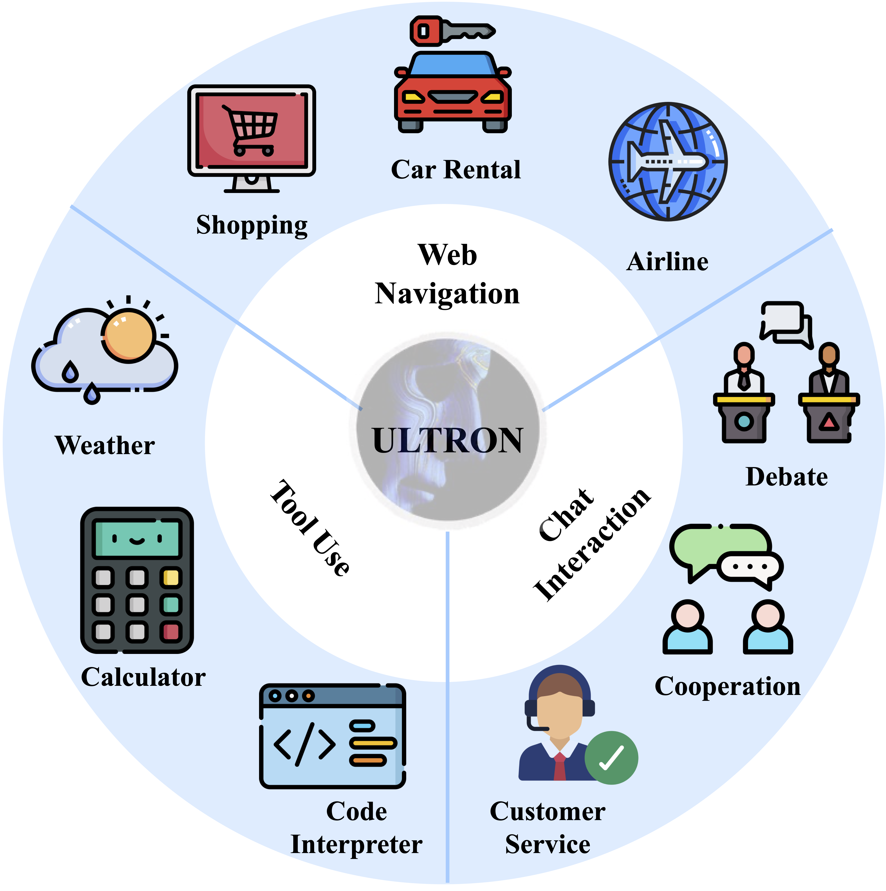

# A Trembling House of Cards? Mapping Adversarial Attacks against Language Agents

<!-- This is the repo for our paper "[A Trembling House of Cards? Mapping Adversarial Attacks against Language Agents](https://arxiv.org/abs/2402.10196)". Stay tuned! -->


Language agents powered by large language models (LLMs) have seen exploding development. Their capability of using language as a vehicle for thought and communication lends an incredible level of flexibility and versatility. People have quickly capitalized on this capability to connect LLMs to a wide range of external components and environments: databases, tools, the Internet, robotic embodiment, etc. Many believe an unprecedentedly powerful automation technology is emerging. 

However, new automation technologies come with new safety risks, especially for intricate systems like language agents. There is a surprisingly large gap between the speed and scale of their development and deployment and our understanding of their safety risks. **Are we building a house of cards?** 

In this work, we present *the first systematic effort in mapping adversarial attacks against language agents*. We first present a unified conceptual framework for agents with three major components: Perception, Brain, and Action. Under this framework, we present a comprehensive discussion and propose 12 potential attack scenarios against different components of an agent, covering different attack strategies (e.g., input manipulation, adversarial demonstrations, jailbreaking, backdoors). We also draw connections to successful attack strategies previously applied to LLMs. We emphasize the urgency to gain a thorough understanding of language agent risks before their widespread deployment.

Paper link: [A Trembling House of Cards? Mapping Adversarial Attacks against Language Agents](https://arxiv.org/abs/2402.10196)

## Table of Content
- [A Hypothetical Generalist Agent](#a-hypothetical-generalist-agent)
  - [1. Web Agents](#1-web-agents)
  - [2. Communicative Agents](#2-communicative-agents)
  - [3. Tool Agents](#3-tool-agents)

- [Conceptual Framework & Adversarial Attacks](#conceptual-framework--adversarial-attacks)
  - [1. Perception](#1-perception)
    - [Attacks - Input Manipulation](#attacks---input-manipulation)

  - [2. Brain](#2-brain)
    - [2.1 Reasoning & Planning](#21-reasoning--planning)
      - [Attacks - Jailbreaking & Prompt Injection](#attacks---jailbreaking--prompt-injection)
    - [2.2 Working Memory](#22-working-memory)
      - [Attacks - Adversarial Demonstration](#attacks---adversarial-demonstration)
    - [2.3 Long-Term Memory](#23-long-term-memory)
      - [Attacks - Backdoors & Data Poisoning](#attacks---backdoors--data-poisoning)

  - [3. Action](#action)
    - [3.1 Tool Augmentation](#31-tool-augmentation)
      - [Attacks - Tool Use](#attacks---tool-use)
    - [3.2 Embodiment](#32-embodiment)
      - [Attacks - Embodiment](#attacks---embodiment)

- [Citation](#citation)

## A Hypothetical Generalist Agent

<!--  -->

<div align=center></div>

We introduce **ULTRON**, a hypothetical language agent designed as a versatile assistant capable of performing complex tasks in both virtual and physical environments. It represents our envisioned agent that could be made possible in the future, drawing upon the development of various types of agents, including Web Agents, Communicative Agents, and Tool Agents. ULTRON integrates the functionalities from these agent categories, including web navigation, chat interaction, and external tool utilization. Below, we compile an overview of relevant work for each agent category.

### 1. Web Agents

- **Webgpt: Browser-assisted question-answering with human feedback** [[paper](https://arxiv.org/abs/2112.09332)]

  *Reiichiro Nakano, Jacob Hilton, Suchir Balaji, Jeff Wu, Long Ouyang, Christina Kim, Christopher Hesse, Shantanu Jain, Vineet Kosaraju, William Saunders, et al. 2021.*

- **Webshop: Towards scalable real-world web interaction with grounded language agents** [[paper](https://proceedings.neurips.cc/paper_files/paper/2022/hash/82ad13ec01f9fe44c01cb91814fd7b8c-Abstract-Conference.html)]

  *Shunyu Yao, Howard Chen, John Yang, and Karthik Narasimhan. 2022.*

- **Mind2web: Towards a generalist agent for the web** [[paper](http://arxiv.org/abs/2306.06070)]

  *Xiang Deng, Yu Gu, Boyuan Zheng, Shijie Chen, Samuel Stevens, Boshi Wang, Huan Sun, and Yu Su. 2023.*

- **Webarena: A realistic web environment for building autonomous agents** [[paper](https://arxiv.org/abs/2307.13854)]

  *Shuyan Zhou, Frank F Xu, Hao Zhu, Xuhui Zhou, Robert Lo, Abishek Sridhar, Xianyi Cheng, Yonatan Bisk, Daniel Fried, Uri Alon, et al. 2023.*

- **Multimodal web navigation with instruction-finetuned foundation models** [[paper](https://arxiv.org/abs/2305.11854)]

  *Hiroki Furuta, Ofir Nachum, Kuang-Huei Lee, Yutaka Matsuo, Shixiang Shane Gu, and Izzeddin Gur. 2023b.*


- **Pix2struct: Screenshot parsing as pretraining for visual language understanding** [[paper](https://arxiv.org/abs/2210.03347)]

  *Kenton Lee, Mandar Joshi, Iulia Raluca Turc, Hexiang Hu, Fangyu Liu, Julian Martin Eisenschlos, Urvashi Khandelwal, Peter Shaw, Ming-Wei Chang, and Kristina Toutanova. 2023.*


- **From pixels to ui actions: Learning to follow instructions via graphical user interfaces** [[paper](https://arxiv.org/abs/2306.00245)]

  *Peter Shaw, Mandar Joshi, James Cohan, Jonathan Berant, Panupong Pasupat, Hexiang Hu, Urvashi Khandelwal, Kenton Lee, and Kristina Toutanova. 2023.*

### 2. Communicative Agents

- **Babyagi: A website for advanced chat-based language models** [[Link](https://github.com/yoheinakajima/babyagi)]

  *Nakajima, Yohei. 2023.*


- **Camel: Communicative agents for "mind" exploration of large scale language model society** [[paper](https://arxiv.org/abs/2303.17760)]

  *Guohao Li, Hasan Abed Al Kader Hammoud, Hani Itani, Dmitrii Khizbullin, and Bernard Ghanem. 2023a.*


- **Metagpt: Meta programming for a multi-agent collaborative framework** [[paper](https://arxiv.org/abs/2308.00352)]

  *Sirui Hong, Mingchen Zhuge, Jonathan Chen, Xiawu Zheng, Yuheng Cheng, Ceyao Zhang, Jinlin Wang, Zili Wang, Steven Ka Shing Yau, Zijuan Lin, Liyang Zhou, Chenyu Ran, Lingfeng Xiao, Chenglin Wu, and Jürgen Schmidhuber. 2023.*

- **Communicative agents for software development** [[paper](https://arxiv.org/abs/2307.07924)]

  *Chen Qian, Xin Cong, Wei Liu, Cheng Yang, Weize Chen, Yusheng Su, Yufan Dang, Jiahao Li, Juyuan Xu, Dahai Li, Zhiyuan Liu, and Maosong Sun. 2023.*


- **Self-collaboration code generation via chatgpt** [[paper](https://arxiv.org/abs/2304.07590)]

  *Yihong Dong, Xue Jiang, Zhi Jin, and Ge Li. 2023.*


- **Autogen: Enabling next-gen llm applications via multi-agent conversation framework** [[paper](https://arxiv.org/abs/2308.08155)]

  *Qingyun Wu, Gagan Bansal, Jieyu Zhang, Yiran Wu, Shaokun Zhang, Erkang Zhu, Beibin Li, Li Jiang, Xiaoyun Zhang, and Chi Wang. 2023.*


### 3. Tool Agents

- **Tool learning with foundation models** [[paper](https://arxiv.org/abs/2304.08354)]

  *Yujia Qin, Shengding Hu, Yankai Lin, Weize Chen, Ning Ding, Ganqu Cui, Zheni Zeng, Yufei Huang, Chaojun Xiao, Chi Han, Yi Ren Fung, Yusheng Su, Huadong Wang, Cheng Qian, Runchu Tian, Kunlun Zhu, Shihao Liang, Xingyu Shen, Bokai Xu, Zhen Zhang, Yining Ye, Bowen Li, Ziwei Tang, Jing Yi, Yuzhang Zhu, Zhenning Dai, Lan Yan, Xin Cong, Yaxi Lu, Weilin Zhao, Yuxiang Huang, Junxi Yan, Xu Han, Xian Sun, Dahai Li, Jason Phang, Cheng Yang, Tongshuang Wu, Heng Ji, Zhiyuan Liu, and Maosong Sun. 2023a.*


- **Mrkl systems: A modular, neuro-symbolic architecture that combines large language models, external knowledge sources and discrete reasoning** [[paper](https://arxiv.org/abs/2205.00445)]

  *Ehud Karpas, Omri Abend, Yonatan Belinkov, Barak Lenz, Opher Lieber, Nir Ratner, Yoav Shoham, Hofit Bata, Yoav Levine, Kevin Leyton-Brown, et al. 2022.*

- **Talm: Tool augmented language models** [[paper](https://arxiv.org/abs/2205.12255)]

  *Aaron Parisi, Yao Zhao, and Noah Fiedel. 2022.*


- **Toolformer: Language models can teach themselves to use tools** [[paper](https://arxiv.org/abs/2302.04761)]

  *Timo Schick, Jane Dwivedi-Yu, Roberto Dessì, Roberta Raileanu, Maria Lomeli, Luke Zettlemoyer, Nicola Cancedda, and Thomas Scialom. 2023.*


- **Gorilla: Large language model connected with massive apis** [[paper](https://arxiv.org/abs/2305.15334)]

  *Shishir G. Patil, Tianjun Zhang, Xin Wang, and Joseph E. Gonzalez. 2023.*

- **Restgpt: Connecting large language models with real-world restful apis** [[paper](https://arxiv.org/abs/2306.06624)]

  *Yifan Song, Weimin Xiong, Dawei Zhu, Wenhao Wu, Han Qian, Mingbo Song, Hailiang Huang, Cheng Li, Ke Wang, Rong Yao, Ye Tian, and Sujian Li. 2023.*

- **Tptu: Large language model-based ai agents for task planning and tool usage** [[paper](https://arxiv.org/abs/2308.03427)]

  *Jingqing Ruan, Yihong Chen, Bin Zhang, Zhiwei Xu, Tianpeng Bao, Guoqing Du, Shiwei Shi, Hangyu Mao, Ziyue Li, Xingyu Zeng, and Rui Zhao. 2023a.*


- **Tptu-v2: Boosting task planning and tool usage of large language model-based agents in real-world systems.** [[paper](https://arxiv.org/abs/2311.11315)]

  *Yilun Kong, Jingqing Ruan, Yihong Chen, Bin Zhang, Tianpeng Bao, Shiwei Shi, Guoqing Du, Xiaoru Hu, Hangyu Mao, Ziyue Li, Xingyu Zeng, and Rui Zhao. 2023.*


## Conceptual Framework & Adversarial Attacks

Under the presented conceptual framework for language agent, we compile the relevant adversarial attacks against different components of an agent, to substantiate the discussions on 12 attack scenarios proposed in our paper. It covers different attack strategies such as input manipulation, adversarial demonstrations, jailbreaking, backdoors, etc.

### 1. Perception

##### Attacks - Input Manipulation

- **Universal and transferable adversarial attacks on aligned language models** [[paper](https://arxiv.org/abs/2307.15043)]

  *Andy Zou, Zifan Wang, J Zico Kolter, and Matt Fredrikson. 2023.*


- **Hard prompts made easy: Gradient-based discrete optimization for prompt tuning and discovery** [[paper](https://arxiv.org/abs/2302.03668)]

  *Yuxin Wen, Neel Jain, John Kirchenbauer, Micah Gold- blum, Jonas Geiping, and Tom Goldstein. 2023.*


- **Are aligned neural networks adversarially aligned?** [[paper](https://arxiv.org/abs/2306.15447)]

  *Nicholas Carlini, Milad Nasr, Christopher A ChoquetteChoo, Matthew Jagielski, Irena Gao, Anas Awadalla, Pang Wei Koh, Daphne Ippolito, Katherine Lee, Florian Tramer, et al. 2023.*


- **Jailbreak in pieces: Compositional adversarial attacks on multi-modal language models** [[paper](https://arxiv.org/abs/2307.14539)]

  *Erfan Shayegani, Yue Dong, and Nael Abu-Ghazaleh. 2023.*


- **Abusing images and sounds for indirect instruction injection in multi-modal llms** [[paper](https://arxiv.org/abs/2307.10490)]

  *Eugene Bagdasaryan, Tsung-Yin Hsieh, Ben Nassi, and Vitaly Shmatikov. 2023.*


- **Visual adversarial examples jailbreak aligned large language models.** [[paper](https://arxiv.org/abs/2306.13213)]

  *Xiangyu Qi, Kaixuan Huang, Ashwinee Panda, Mengdi Wang, and Prateek Mittal. 2023.*


### 2. Brain

#### 2.1 Reasoning & Planning

##### Attacks - Jailbreaking & Prompt Injection

- **Ignore previous prompt: Attack techniques for language models** [[paper](https://arxiv.org/abs/2211.09527)]

  *Fábio Perez and Ian Ribeiro. 2022.*

- **Not what you’ve signed up for: Compromising real-world llm-integrated applications with indirect prompt injection** [[paper](https://arxiv.org/abs/2302.12173)]

  *Sahar Abdelnabi, Kai Greshake, Shailesh Mishra, Christoph Endres, Thorsten Holz, and Mario Fritz. 2023.*

- **How to jailbreak chatgpt** [[Link](https://watcher.guru/news/how-to-jailbreak-chatgpt)]

  *Lavina Daryanani. 2023.*

- **Gptfuzzer: Red teaming large language models with auto-generated jailbreak prompts** [[paper](https://arxiv.org/abs/2309.10253)]

  *Jiahao Yu, Xingwei Lin, Zheng Yu, and Xinyu Xing. 2023.*

- **Prompt packer: Deceiving llms through compositional instruction with hidden attacks** [[paper](https://arxiv.org/abs/2310.10077)]

  *Shuyu Jiang, Xingshu Chen, and Rui Tang. 2023.*

- **Low-resource languages jailbreak gpt-4** [[paper](https://arxiv.org/abs/2310.02446)]

  *Zheng-Xin Yong, Cristina Menghini, and Stephen H. Bach. 2023.*

- **Evil geniuses: Delving into the safety of llm-based agents** [[paper](https://arxiv.org/abs/2311.11855)]

  *Yu Tian, Xiao Yang, Jingyuan Zhang, Yinpeng Dong, and Hang Su. 2023.*

- **Psysafe: A comprehensive framework for psychological-based attack, defense, and evaluation of multi-agent system safety** [[paper](https://arxiv.org/abs/2401.11880)]

  *Zaibin Zhang, Yongting Zhang, Lijun Li, Hongzhi Gao, Lijun Wang, Huchuan Lu, Feng Zhao, Yu Qiao, and Jing Shao. 2024.*

- **How Johnny Can Persuade LLMs to Jailbreak Them: Rethinking Persuasion to Challenge AI Safety by Humanizing LLMs** [[paper](http://arxiv.org/abs/2401.06373)]

  *Yi Zeng, Hongpeng Lin, Jingwen Zhang, Diyi Yang, Ruoxi Jia, and Weiyan Shi. 2024.*


#### 2.2 Working Memory

##### Attacks - Adversarial Demonstration

- **Adversarial demonstration attacks on large language models** [[paper](https://arxiv.org/abs/2305.14950)]

  *Jiongxiao Wang, Zichen Liu, Keun Hee Park, Zhuojun Jiang, Zhaoheng Zheng, Zhuofeng Wu, Muhao Chen, and Chaowei Xiao. 2023c.*

- **Jailbreak and guard aligned language models with only few in-context demonstrations** [[paper](https://arxiv.org/abs/2310.06387)]

  *Zeming Wei, Yifei Wang, and Yisen Wang. 2023b.*

- **How trustworthy are open-source llms? an assessment under malicious demonstrations shows their vulnerabilities** [[paper](https://arxiv.org/abs/2311.09447)]

  *Lingbo Mo, Boshi Wang, Muhao Chen, and Huan Sun. 2023.*

- **Large language models can be guided to evade ai-generated text detection** [[paper](https://arxiv.org/abs/2305.10847)]

  *Ning Lu, Shengcai Liu, Rui He, Qi Wang, Yew-Soon Ong, and Ke Tang. 2023.*

- **Universal vulnerabilities in large language models: In-context learning backdoor attacks.** [[paper](https://arxiv.org/abs/2401.05949)]

  *Shuai Zhao, Meihuizi Jia, Luu Anh Tuan, and Jinming Wen. 2024.*


#### 2.1 Long-Term Memory

##### Attacks - Backdoors & Data Poisoning

- **Blind backdoors in deep learning models** [[paper](https://arxiv.org/abs/2005.03823)]

  *Eugene Bagdasaryan and Vitaly Shmatikov. 2021.*

- **Backdoor learning: A survey** [[paper](https://arxiv.org/abs/2007.08745)]

  *Yiming Li, Yong Jiang, Zhifeng Li, and Shu-Tao Xia. 2022.*

- **On the exploitability of instruction tuning** [[paper](https://arxiv.org/abs/2306.17194)]

  *Manli Shu, Jiongxiao Wang, Chen Zhu, Jonas Geiping, Chaowei Xiao, and Tom Goldstein. 2023.*

- **Poisoning language models during instruction tuning** [[paper](https://arxiv.org/abs/2305.00944)]

  *Alexander Wan, Eric Wallace, Sheng Shen, and Dan Klein. 2023.*

- **BITE: Textual backdoor attacks with iterative trigger injection** [[paper](https://arxiv.org/abs/2205.12700)]

  *Jun Yan, Vansh Gupta, and Xiang Ren. 2023a.*

- **Backdoor learning on sequence to sequence models** [[paper](https://arxiv.org/abs/2305.02424)]

  *Lichang Chen, Minhao Cheng, and Heng Huang. 2023.*

- **Instructions as backdoors: Backdoor vulnerabilities of instruction tuning for large language models** [[paper](https://arxiv.org/abs/2305.14710)]

  *Jiashu Xu, Mingyu Derek Ma, Fei Wang, Chaowei Xiao, and Muhao Chen. 2023.*


- **Backdoor attacks and countermeasures in natural language processing models: A comprehensive security review** [[paper](https://arxiv.org/abs/2309.06055)]

  *Pengzhou Cheng, Zongru Wu, Wei Du, and Gongshen Liu. 2023.*

- **Badchain: Backdoor chain-of-thought prompting for large language models** [[paper](https://arxiv.org/abs/2401.12242)]

  *Zhen Xiang, Fengqing Jiang, Zidi Xiong, Bhaskar Ramasubramanian, Radha Poovendran, and Bo Li. 2024.*

### 3. Action

#### 3.1 Tool Augmentation

##### Attacks - Tool Use

- **Identifying the risks of lm agents with an lm-emulated sandbox** [[paper](https://arxiv.org/abs/2309.15817)]

  *Yangjun Ruan, Honghua Dong, Andrew Wang, Silviu Pitis, Yongchao Zhou, Jimmy Ba, Yann Dubois, Chris J. Maddison, and Tatsunori Hashimoto. 2023b.*

- **R-judge: Benchmarking safety risk awareness for llm agents** [[paper](https://arxiv.org/abs/2401.10019)]

  *Tongxin Yuan, Zhiwei He, Lingzhong Dong, Yiming Wang, Ruijie Zhao, Tian Xia, Lizhen Xu, Binglin Zhou, Fangqi Li, Zhuosheng Zhang, Rui Wang, and Gongshen Liu. 2024.*

- **Adaptive chameleon or stubborn sloth: Unraveling the behavior of large language models in knowledge conflicts** [[paper](https://arxiv.org/abs/2305.13300)]

  *Jian Xie, Kai Zhang, Jiangjie Chen, Renze Lou, and Yu Su. 2023.*

- **Empirical evaluation of api usability and security** [[Link](https://insights.sei.cmu.edu/blog/empirical-evaluation-of-api-usability-and-security/)]

  *Sam Weber. 2016.*

- **Advanced api security** [[paper](https://link.springer.com/book/10.1007/978-1-4842-2050-4)]

  *Prabath Siriwardena. 2014.*


#### 3.2 Embodiment

##### Attacks - Embodiment

- **Universal adversarial perturbations** [[paper](https://arxiv.org/abs/1610.08401)]

  *Seyed-Mohsen Moosavi-Dezfooli, Alhussein Fawzi, Omar Fawzi, and Pascal Frossard. 2017.*

- **Spatiotemporal attacks for embodied agents** [[paper](https://arxiv.org/abs/2005.09161)]

  *Aishan Liu, Tairan Huang, Xianglong Liu, Yitao Xu, Yuqing Ma, Xinyun Chen, Stephen J Maybank, and Dacheng Tao. 2020.*

- **Consistent attack: Universal adversarial perturbation on embodied vision navigation** [[paper](https://arxiv.org/abs/2206.05751)]

  *Chengyang Ying, You Qiaoben, Xinning Zhou, Hang Su, Wenbo Ding, and Jianyong Ai. 2023.*

## Citation
```
@misc{mo2024trembling,
      title={A Trembling House of Cards? Mapping Adversarial Attacks against Language Agents}, 
      author={Lingbo Mo and Zeyi Liao and Boyuan Zheng and Yu Su and Chaowei Xiao and Huan Sun},
      year={2024},
      eprint={2402.10196},
      archivePrefix={arXiv},
      primaryClass={cs.CL}
}
```
